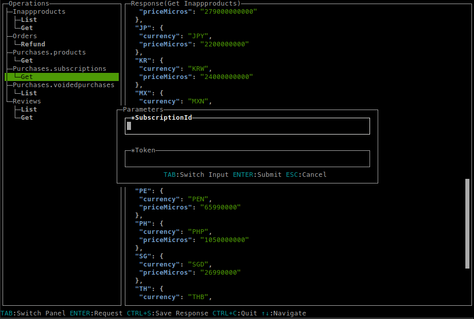

# androidpublisher

CLI app to interact with Google Play Developer API

## Installation 

### Pre-built binaries

See [releases](https://github.com/hassansin/androidpublisher/releases)

### From Source
```sh
go install github.com/hassansin/androidpublisher
```

## Usage

```sh
androidpublisher --package com.example.android --credentials "path to service account JSON key file"
```

[How to create service account](https://developers.google.com/android-publisher/getting_started#using_a_service_account)


## Screenshots



### TODO

* scrollbar
*
